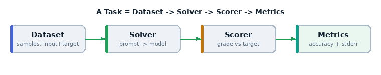

# 01 · Hello, eval

The smallest complete Inspect evaluation. If you understand this file, you
understand the spine of every other example: **a `Task` is a `dataset`, a
`solver`, and a `scorer`.**



*Every example follows this shape.*

## What it teaches

- the three-part shape of a `Task`
- building a `dataset` inline from `Sample` objects
- a **chain solver** (a list of solvers that run in order)
- **model-graded** scoring, where a second model judges the answer
- reading accuracy + standard error and a per-sample transcript

## The code, line by line

```python
@task
def hello():
    return Task(
        dataset=[
            Sample(input="What is the capital of France?", target="Paris"),
            ...
        ],
        solver=[system_message("Answer as concisely as possible."), generate()],
        scorer=model_graded_qa(),
    )
```

- **`@task`** registers the function so the `inspect` CLI can find and run it.
  A file can hold several `@task`s.
- **`dataset`** is a list of `Sample`s. Each `Sample` has an `input` (the prompt
  the model sees) and a `target` (the reference answer used for grading). Here we
  hard-code three samples; later examples load thousands from files or the Hub.
- **`solver`** is the pipeline that turns a sample into an answer. It's a *list*,
  so it runs in order on a shared `TaskState`:
  - `system_message(...)` prepends a system prompt to the conversation.
  - `generate()` calls the model once and stores its reply as the output.
- **`scorer`** turns the output into a score. `model_graded_qa()` sends the
  question, the model's answer, and the `target` to a **grader model**, which
  decides correct/incorrect and writes a short justification.

## Run it

```bash
inspect eval examples/01_hello/task.py --model openai/gpt-4o-mini
inspect view
```

`--model` sets the model under test. The grader defaults to the same model (you
can change it — see example 09).

## What happens, step by step

1. Inspect loads the task and expands the dataset (3 samples).
2. For each sample it runs the solver: system message → `generate()` → output.
3. The scorer asks the grader model to judge each output against the target.
4. Scores are aggregated into **accuracy** and a **standard error**, and the full
   run is written to a `.eval` log under `./logs`.

## What to look for in the viewer

- per-sample: the prompt, the model's answer, the score, and the grader's
  **explanation** (why it was marked right or wrong)
- the headline metric block: `accuracy` and `stderr`

## Try this next

- swap the model: `--model anthropic/claude-sonnet-4-0`
- make grading stricter by editing the system message, or replace
  `model_graded_qa()` with `match()` (exact match) and see how the score changes
- add your own `Sample`s
