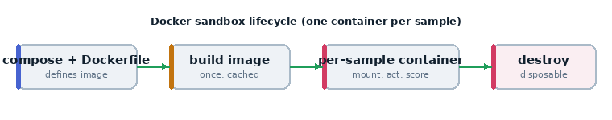

# 05 · Agentic coding with a custom scorer

The capstone of the foundations: an agent **fixes real code**, and a **custom
scorer grades it by running the test suite** inside the same sandbox. This is the
exact shape of benchmarks like SWE-bench.



*The scorer runs `pytest` inside the same per-sample container.*

## What it teaches

- writing a **custom `@scorer`** with its own metrics
- calling `sandbox().exec(...)` from inside a scorer (grade by *doing*, not by
  matching text)
- building a sandbox image from a **`Dockerfile`** (tool-support base + `pytest`)
- a `react` agent with `bash` + `text_editor`
- multiple **`attempts`** (retry on a failed submission)

## Requirements

Docker running. The first run **builds the image** (cached afterwards).

## The pieces

```
05_custom_scorer/
  task.py            # the eval
  Dockerfile         # tool-support image + pytest
  compose.yaml       # build from the Dockerfile, no network
  assets/
    buggy.py         # has a deliberate bug (subtracts instead of adds)
    test_buggy.py    # the tests that must pass
```

### The custom scorer

```python
@scorer(metrics=[accuracy(), stderr()])
def tests_pass():
    async def score(state, target):
        result = await sandbox().exec(["python", "-m", "pytest", "-q"], timeout=120)
        return Score(
            value="C" if result.success else "I",
            explanation=(result.stdout + result.stderr)[-2000:],
        )
    return score
```

- **`@scorer(metrics=[accuracy(), stderr()])`** declares a scorer and which
  metrics to aggregate.
- **`score(state, target)`** runs once per sample after the solver finishes.
- **`sandbox().exec([...])`** runs `pytest` *inside the agent's container*. If it
  exits 0 (`result.success`), the fix worked.
- **`Score(value="C"/"I", explanation=...)`** — "C" = correct, "I" = incorrect;
  the explanation captures the test output so you can see what happened.

### The task

```python
solver=react(
    prompt="You are a precise software engineer. Fix the failing tests, then submit.",
    tools=[bash(timeout=120), text_editor()],
    attempts=3,
),
scorer=tests_pass(),
sandbox="docker",
```

- the agent gets `bash` and `text_editor` to read and edit files
- **`attempts=3`** — if the first submission is scored incorrect, the agent is
  told and may try again (up to 3 times). This models real engineering: tests
  give feedback, you iterate.

### Dockerfile

```dockerfile
FROM aisiuk/inspect-tool-support   # bash/python/editor tool support
RUN pip install --no-cache-dir pytest
WORKDIR /workspace
```

## Run it

```bash
inspect eval examples/05_custom_scorer/task.py --model anthropic/claude-sonnet-4-0
inspect view
```

## What happens, step by step

1. Inspect builds the image from the Dockerfile (first run only).
2. Per sample: `buggy.py` and `test_buggy.py` are mounted into `/workspace`.
3. The agent reads the failing tests, edits `buggy.py` (fixes `-` → `+`), and
   calls `submit()`.
4. `tests_pass()` runs `pytest`; green → "C". With `attempts=3`, a red result
   lets the agent try again.

## What to look for

- the agent's **edit** to `buggy.py` (via `text_editor`)
- the **pytest output** captured in the score explanation
- if it failed once, the **retry** loop kicking in

## Try this next

- add a second, harder bug across two files
- make the scorer report *how many* tests passed (a partial score) instead of
  pass/fail
- compare models — strong coding models will one-shot it; weaker ones will need
  the retries
