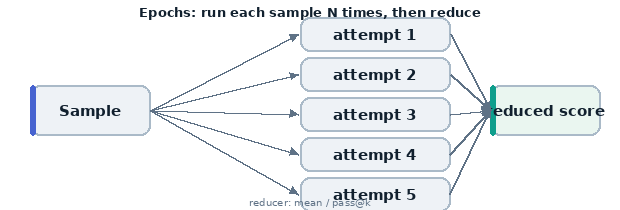

# 08 · Reliability with epochs & pass@k

A single run of a stochastic task is noisy. **Epochs** repeat each sample several
times; a **reducer** collapses the repeats into one score. This turns "did it get
lucky once" into a real reliability estimate.



## What it teaches

- `Epochs(count, reducer)` on a `Task`
- the `--epochs` CLI flag
- reducers: `mean`, `pass_at_1`, `pass_at_k`, `at_least_n`, `median`, `max`
- why reliability ≠ a single accuracy number

## The code, line by line

```python
@task
def reliability():
    return Task(
        dataset=[
            Sample(input="Reply with ONLY the number 7.", target="7"),
            Sample(input="Reply with ONLY the word 'banana'.", target="banana"),
        ],
        solver=generate(),
        epochs=Epochs(5, "pass_at_1"),
        scorer=match(),
    )
```

- **`epochs=Epochs(5, "pass_at_1")`** — run **each** sample 5 times, then reduce:
  - `pass_at_1` here means "scored correct if any single attempt is correct"
    (the pass@k family answers "could the model do it in k tries").
  - other reducers: `mean` (average score), `median`, `max`, `at_least_2`
    (≥2 of the attempts correct), etc.
- **`match()`** — exact-match scoring per attempt (before reduction).

## Run it

```bash
# epochs from the task (5), or override on the CLI:
inspect eval examples/08_epochs_reliability/task.py --model openai/gpt-4o-mini --epochs 5
inspect eval examples/08_epochs_reliability/task.py --model openai/gpt-4o-mini \
  --epochs 10 --epochs-reducer mean
```

## What happens, step by step

1. Each of the 2 samples is run 5 times → 10 model calls.
2. `match()` scores each attempt.
3. The reducer collapses each sample's 5 attempts into one score.
4. Accuracy + stderr are computed across the reduced per-sample scores.

## What to look for

- per-sample, the **multiple attempts** and how the reducer combined them
- how the headline number changes between `pass_at_1` (optimistic) and `mean`
  (average behaviour)

## Try this next

- switch the reducer to `mean` and compare to `pass_at_1`
- bump `--epochs 20` on a genuinely hard sample to see variance shrink
- pair with a coding task (example 05) where `pass_at_k` is the standard metric
