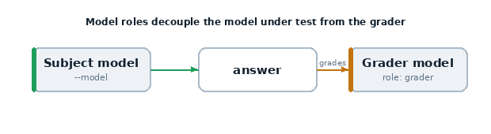

# 09 · Model roles

Hard-coding model names everywhere is brittle. **Model roles** let you name the
models in an eval (e.g. `grader`, `red_team`, `blue_team`) and bind real models to
those names at run time — without editing the task.



## What it teaches

- `model_roles={...}` on a `Task`
- the `--model-role` CLI flag
- that model-graded scorers use the **`grader`** role by default
- decoupling the *model under test* from the *grader*

## The code, line by line

```python
@task
def roles_demo():
    return Task(
        dataset=[
            Sample(
                input="Explain in one sentence why the sky is blue.",
                target="Rayleigh scattering of sunlight by the atmosphere.",
            )
        ],
        solver=generate(),
        scorer=model_graded_qa(),
        model_roles={"grader": "openai/gpt-4o-mini"},
    )
```

- **`solver=generate()`** uses the **main** model (the `--model` you pass).
- **`scorer=model_graded_qa()`** grades using the **`grader`** role.
- **`model_roles={"grader": "openai/gpt-4o-mini"}`** sets a default grader. You
  can override it per run from the CLI.

## Run it

```bash
# subject = gpt-4o-mini, grader = gpt-4o
inspect eval examples/09_model_roles/task.py \
  --model openai/gpt-4o-mini --model-role grader=openai/gpt-4o
```

## What happens, step by step

1. `generate()` answers using the `--model`.
2. `model_graded_qa()` resolves the `grader` role (CLI override > task default >
   the main model) and grades with it.
3. The transcript records which model played which role.

## Why it matters

- **Stronger graders.** Keep a strong, fixed grader while you sweep cheaper
  models under test.
- **Red/blue teaming.** Define `red_team` and `blue_team` roles and vary them
  across an eval set (see the Inspect docs) — central to adversarial safety evals.
- **Reproducibility.** The roles (and the models bound to them) are recorded in
  the log.

## Try this next

- access a role in your own scorer: `get_model(role="grader")`
- define a second role and a custom scorer that uses it
- run an `eval_set` (example 13) that varies the grader across tasks
