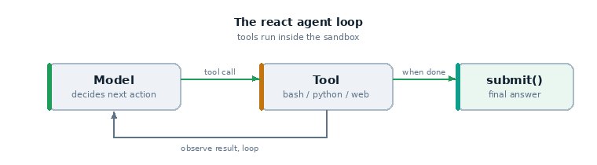

# 11 · A research agent (web search)

An agent that answers open questions by **searching the web**, then is graded by a
model. This is the simplest "tool that reaches the outside world" example.



*Here the tool is `web_search` instead of `bash`.*

## What it teaches

- the `react` agent with the `web_search` tool
- tools that call external services (vs the in-process tool of example 03)
- model-graded scoring of free-form answers
- the operational reality that web search needs a **provider**

## The code, line by line

```python
@task
def researcher():
    return Task(
        dataset=[
            Sample(input="What is the boiling point of water at sea level in Celsius?",
                   target="100 degrees Celsius"),
            Sample(input="In what year did the first iPhone go on sale?", target="2007"),
        ],
        solver=react(tools=[web_search()]),
        scorer=model_graded_qa(),
    )
```

- **`react(tools=[web_search()])`** — the agent loops, deciding when to search and
  with what query, reading results, and finally calling `submit()`.
- **`web_search()`** — issues real searches and returns summarised results to the
  model.
- **`model_graded_qa()`** — grades the final answer against the `target`
  semantically (so "100°C" and "100 degrees Celsius" both pass).

## Provider required

`web_search()` needs a search backend:

- some model providers (certain OpenAI/Anthropic models) offer **built-in** search
  — then it works with no extra setup;
- otherwise configure an **external** provider (e.g. Tavily, Google CSE) per the
  [Inspect web-search docs](https://inspect.aisi.org.uk/tools-standard.html#sec-web-search),
  usually via an env var/API key in your `.env`.

If you don't have one configured, use example 12 instead (no external calls).

## Run it

```bash
inspect eval examples/11_web_search_agent/task.py --model openai/gpt-4o
```

## What happens, step by step

1. The agent reads the question and emits a `web_search` call with a query.
2. Inspect runs the search and returns results to the model.
3. The model may search again or `submit()` an answer.
4. `model_graded_qa()` grades it.

## What to look for

- the **search queries** the agent chose (good agents refine queries)
- the **results** returned and how the model used them
- whether it answered from the results or from memory (try a question about a very
  recent event to force a real search)

## Try this next

- add a `web_browser()` tool so the agent can open and read pages, not just
  snippets
- give it a `bash` tool in a sandbox to save/process what it finds
