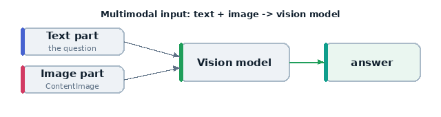

# 14 · Vision — single-image question answering

The first **multimodal** example. Instead of a plain string, the sample's input
is a chat message that mixes **text and an image**. A vision-capable model looks
at the picture and answers.



The image the model sees:


## What it teaches

- building a multimodal `Sample.input` from message + content parts
- `ChatMessageUser`, `ContentText`, `ContentImage`
- referencing a local image file from the example directory
- which models support vision

## The image

`assets/shape.png` is a **red circle** on white (generated with Pillow). The model
should answer "red".

## The code, line by line

```python
IMG = str(Path(__file__).parent / "assets" / "shape.png")

Sample(
    input=[
        ChatMessageUser(
            content=[
                ContentText(text="What colour is the shape? Answer with one word."),
                ContentImage(image=IMG),
            ]
        )
    ],
    target="red",
)
...
solver=generate(),
scorer=includes(),
```

- **`input` is a list of chat messages**, not a string. Multimodal prompts must be
  built explicitly.
- **`ChatMessageUser(content=[...])`** — a user turn whose content is a list of
  parts.
- **`ContentText(...)`** — the text part (the question).
- **`ContentImage(image=IMG)`** — the image part. `image` accepts a local path
  (used here), a URL, or a base64 data URI. We build an absolute path from
  `__file__` so it works regardless of where you run `inspect` from.
- **`includes()`** — correct if the answer contains "red" (case-insensitive).

## Run it — needs a vision model

```bash
inspect eval examples/14_image_vqa/task.py --model openrouter/openai/gpt-5.4
# also fine: openrouter/anthropic/claude-opus-4.8, openrouter/google/gemini-3.5-flash
```

A text-only model will error or refuse — vision capability is required.

## What happens, step by step

1. Inspect encodes the image and sends it with the text to the model.
2. The model returns a one-word colour.
3. `includes()` checks for "red".

## What to look for

- the **image rendered** in the transcript alongside the question
- the model's answer (and how brittle it is if you make the question vaguer)

## Try this next

- add more shapes/colours as separate samples
- swap `includes()` for `match()` to require an exact single word
- point `ContentImage(image=...)` at a URL instead of a local file
