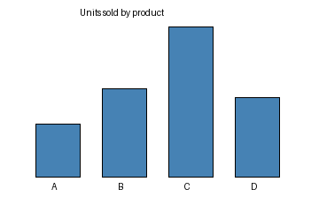

# 15 · Vision — chart understanding

A step up from "name the colour": the model must **read a chart** and reason about
it. Chart/document understanding is a common real-world multimodal eval (finance,
science, analytics).

The chart the model must read:



## What it teaches

- multimodal prompting applied to an information-dense image
- asking for a structured, gradeable answer (a single letter)
- testing whether a model actually *reads* the chart vs guesses

## The image

`assets/sales.png` is a bar chart of "units sold" for products **A, B, C, D**,
where **C** is the tallest bar. Correct answer: `C`.

## The code, line by line

```python
IMG = str(Path(__file__).parent / "assets" / "sales.png")

Sample(
    input=[
        ChatMessageUser(content=[
            ContentText(text="This bar chart shows units sold per product (A-D). "
                             "Which product sold the most? Answer with the single letter."),
            ContentImage(image=IMG),
        ])
    ],
    target="C",
)
...
solver=generate(),
scorer=includes(),
```

- same multimodal structure as example 14, but the task requires **comparison**
  across bars, not just perception.
- the prompt asks for **one letter** so scoring is unambiguous.
- **`includes()`** checks for "C".

## Run it — needs a vision model

```bash
inspect eval examples/15_image_chart/task.py --model openrouter/openai/gpt-5.4
```

## What happens, step by step

1. The chart image + question go to the model.
2. The model identifies the tallest bar and replies with its letter.
3. `includes()` checks against `C`.

## What to look for

- whether the model picks the genuinely tallest bar (some models misread axes or
  pick the rightmost/leftmost)
- failure modes: if it answers a product *name* instead of a letter, tighten the
  prompt or use `match()`

## Try this next

- regenerate the chart with different values (edit the Pillow snippet that made
  it) and update the target — a quick way to build many samples
- ask harder questions ("which two combined exceed C?") to probe real chart
  reasoning
