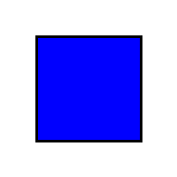
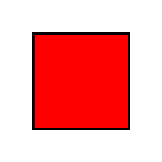

# 16 · Vision — comparing two images

Now there are **two images in a single prompt** and the question is *relational*.
This is the shape of spot-the-difference, before/after, and consistency-check
evals.

The two images compared in one prompt:

| left | right |
|---|---|
|  |  |

## What it teaches

- putting **multiple `ContentImage` parts** in one message
- relational reasoning across images
- a yes/no gradeable target

## The images

`assets/left.png` is a **blue** square; `assets/right.png` is a **red** square. So
"are they the same colour?" → **no**.

## The code, line by line

```python
LEFT = str(ASSETS / "left.png")
RIGHT = str(ASSETS / "right.png")

Sample(
    input=[
        ChatMessageUser(content=[
            ContentText(text="Here are two images. Are the squares the same colour? "
                             "Answer yes or no."),
            ContentImage(image=LEFT),
            ContentImage(image=RIGHT),
        ])
    ],
    target="no",
)
...
solver=generate(),
scorer=includes(),
```

- **two `ContentImage` parts** follow the text in the same user message. Order is
  preserved, so the model sees "left" then "right".
- the question forces a **comparison** rather than per-image perception.
- **`includes()`** checks for "no".

## Run it — needs a vision model

```bash
inspect eval examples/16_image_compare/task.py --model openrouter/openai/gpt-5.4
```

## What happens, step by step

1. Both images + the question go to the model in one turn.
2. The model compares the colours and answers yes/no.
3. `includes()` checks for "no".

## What to look for

- whether the model reliably distinguishes the two (easy here, but a good
  baseline)
- how it behaves if you make them the *same* colour (flip the expected answer and
  the target)

## Try this next

- generate near-identical images with one small difference for a real
  spot-the-difference test
- ask it to **describe** the difference and grade with `model_graded_qa()`
- extend to before/after screenshots for UI-change detection
